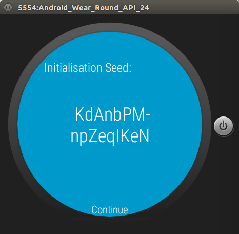
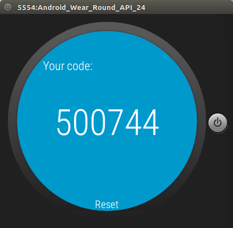

# totp-wear
Standalone TOTP Auth for Android Wear (Nougat)

With the standalone app function of Android Wear from Android N onwards, we can do 2FA without the phone!

Also check out my other project, the server side authentication service:
https://github.com/icha024/Google-Auth-TOTP-Server

